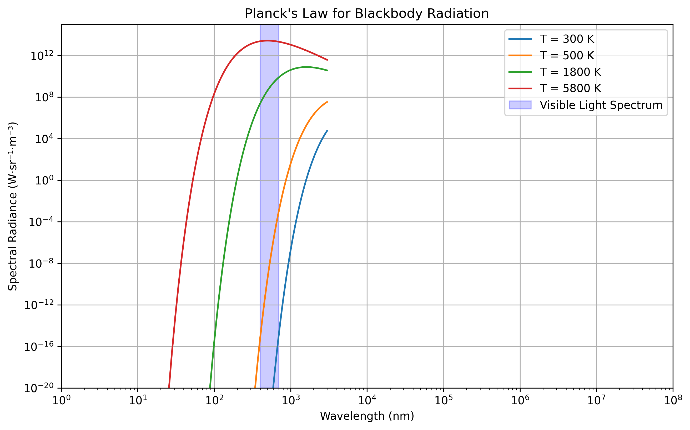

[](https://opensource.org/licenses/MIT)
[](https://radiative-cooling-simulator-kalebsabo.streamlit.app/)

# Space Radiative Cooling Simulator 🌌

A interactive web tool for simulating radiative cooling in space environments. Explore how objects reject heat via thermal radiation in vacuum.

## Demo / Live App

[Try it live here!](https://radiative-cooling-simulator-kalebsabo.streamlit.app/)

## Features

- Features templates for different solar events and material/paint
- In Custom Mode, Adjust parameters manually like emissivity, absorptivity and solar flux
- Adjustable plots of cooling curves and equilibrium temperatures
- Based on Stefan-Boltzmann's and Planck's laws of blackbody radiation. 
- Educational explanations and tooltips

Notes on equations and derivations in `notes/` folder.

- [Planck's Law](Notes/01_Plancks_Law.md)
- [Stefan-Boltzmann Law](Notes/02_Stefon_Boltzmann_Law.md)



## References & Resources

## References & Resources

- Sheldahl Thermal Control Materials Catalog ("Red Book"), latest available edition.  
  Available at: [https://www.sheldahl.com/sites/default/files/2020-02/RedBook.pdf](https://www.sheldahl.com/sites/default/files/2020-02/RedBook.pdf) (or the most recent version from Sheldahl's website).

- Gilmore, D. G. (Ed.). (2002). *Spacecraft Thermal Control Handbook, Volume I: Fundamental Technologies* (2nd ed.). The Aerospace Press / El Segundo, CA: The Aerospace Corporation.
  
- National Aeronautics and Space Administration. (2023). [*NASA Passive Thermal Control Engineering Guidebook*](https://ntrs.nasa.gov/api/citations/20230013900/downloads/NASA%20Thermal%20Control%20Engineering%20Guidebook%20v4.pdf) (Revision 4.0). NASA Langley Research Center.  

- Material properties (e.g., Z93 paint, OSRs) adapted from NASA and industry standards referenced in the above sources.

Special thanks to open NASA resources and the aerospace thermal control community for making this knowledge accessible.

## Installation

```bash
git clone https://github.com/KalebSabo/radiative-cooling-simulator.git
cd radiative-cooling-simulator  
pip install -r requirements.txt 
python radiative_cooling_sim.py  # Run basic simulation
streamlit run app.py  # Interactive dashboard
